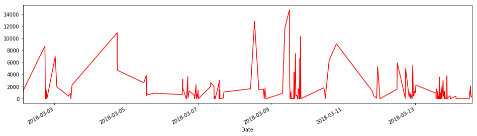
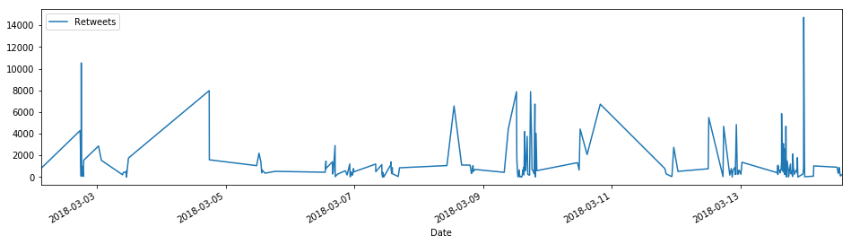
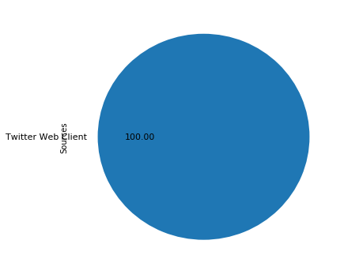

```python
!pip install tweepy pandas numpy
```

    Requirement already satisfied: tweepy in /anaconda3/lib/python3.6/site-packages
    Requirement already satisfied: pandas in /anaconda3/lib/python3.6/site-packages
    Requirement already satisfied: numpy in /anaconda3/lib/python3.6/site-packages
    Requirement already satisfied: requests>=2.4.3 in /anaconda3/lib/python3.6/site-packages (from tweepy)
    Requirement already satisfied: six>=1.7.3 in /anaconda3/lib/python3.6/site-packages (from tweepy)
    Requirement already satisfied: requests-oauthlib>=0.4.1 in /anaconda3/lib/python3.6/site-packages (from tweepy)
    Requirement already satisfied: python-dateutil>=2 in /anaconda3/lib/python3.6/site-packages (from pandas)
    Requirement already satisfied: pytz>=2011k in /anaconda3/lib/python3.6/site-packages (from pandas)
    Requirement already satisfied: chardet<3.1.0,>=3.0.2 in /anaconda3/lib/python3.6/site-packages (from requests>=2.4.3->tweepy)
    Requirement already satisfied: idna<2.7,>=2.5 in /anaconda3/lib/python3.6/site-packages (from requests>=2.4.3->tweepy)
    Requirement already satisfied: urllib3<1.23,>=1.21.1 in /anaconda3/lib/python3.6/site-packages (from requests>=2.4.3->tweepy)
    Requirement already satisfied: certifi>=2017.4.17 in /anaconda3/lib/python3.6/site-packages (from requests>=2.4.3->tweepy)
    Requirement already satisfied: oauthlib>=0.6.2 in /anaconda3/lib/python3.6/site-packages (from requests-oauthlib>=0.4.1->tweepy)


```python
!pip install matplotlib seaborn
```

    Requirement already satisfied: matplotlib in /anaconda3/lib/python3.6/site-packages
    Requirement already satisfied: seaborn in /anaconda3/lib/python3.6/site-packages
    Requirement already satisfied: numpy>=1.7.1 in /anaconda3/lib/python3.6/site-packages (from matplotlib)
    Requirement already satisfied: six>=1.10 in /anaconda3/lib/python3.6/site-packages (from matplotlib)
    Requirement already satisfied: python-dateutil>=2.0 in /anaconda3/lib/python3.6/site-packages (from matplotlib)
    Requirement already satisfied: pytz in /anaconda3/lib/python3.6/site-packages (from matplotlib)
    Requirement already satisfied: cycler>=0.10 in /anaconda3/lib/python3.6/site-packages (from matplotlib)
    Requirement already satisfied: pyparsing!=2.0.4,!=2.1.2,!=2.1.6,>=2.0.1 in /anaconda3/lib/python3.6/site-packages (from matplotlib)
    Requirement already satisfied: scipy in /anaconda3/lib/python3.6/site-packages (from seaborn)
    Requirement already satisfied: pandas in /anaconda3/lib/python3.6/site-packages (from seaborn)


```python
import tweepy
import pandas as pd
import numpy as np
```


```python
CONSUMER_KEY    = 'hT0aFpPfW45vFtxLTBt1YvKtT' 
CONSUMER_SECRET = 'JgEdMEvL0qQmTCiJWtWFTN8wj3Tb2FTOWNeKqMwCxv7DDT9dex'
ACCESS_TOKEN  = '418294626-bh2h8OVcadpgpaaeCzgcIE3eqK1fVcOt1rDwWOfp'
ACCESS_SECRET = 'KW7SCapwLVD5j8j1adcuigvf4Gm0M9pRrcoDWG3heqDOj'
```


```python
def twitter_setup():
    auth = tweepy.OAuthHandler(CONSUMER_KEY, CONSUMER_SECRET)
    auth.set_access_token(ACCESS_TOKEN, ACCESS_SECRET)
    api = tweepy.API(auth)
    return api
```


```python
extractor = twitter_setup()

tweets = extractor.user_timeline(screen_name="JulianAssange", count=200)
print("Number of tweets extracted:", len(tweets))

print("20 recent tweets:\n")
for tweet in tweets[:20]:
    print(tweet.text)
    print()
```

    Number of tweets extracted: 200
    20 recent tweets:
    
    The publicly stated response by May is unfortunately entirely predictable. The failure to expel the Russian ambassa… https://t.co/uls8AHcyvp
    
    Whilst expelling suspected intelligence agents is showy deterrent (such agents apply pressure towards their governm… https://t.co/jkUNhYCnrL
    
    Russia would normally expel 23 UK diplomatic agents now. The one week period granted to Russia's diplomats is likel… https://t.co/Cd1pbHTLWD
    
    UK gives 23 Russian diplomats it says are suspected intelligence officers one week to leave the country. The only w… https://t.co/UjWGQkKnHy
    
    Theresa May is in a difficult position. If the Kremlin was knowingly behind the claimed nerve agent attack on Serge… https://t.co/Ph5AtFhCgu
    
    UK Foreign Office gears up for a propaganda war against Russia with video listing alleged Russian bad behavior. Con… https://t.co/LvBdmhQrqW
    
    Mawkish tributes pour in for Stephen Hawking from people who never understood his work. But many were genuinely awe… https://t.co/ENlXr9dKrc
    
    RT @foreignoffice: The UK has called for an urgent meeting of the UN Security Council to update Council members on the investigation into t…
    
    RT @AssangeFreedom: Australian govt gives notorious paedophile $500,000 to fight 75 charges incl rape, murder &amp; torturing babies for videos…
    
    @JackPosobiec Irrelevant. The editor of most serious publications speak to as many people as possible and that is right and proper.
    
    @dwmzmm @Dj_MadArab @KimDotcom He took at least $25m and perhaps as much as $100m from ultra-Zionist Sheldon Abelson during the campaign.
    
    RT @jeremyscahill: MSNBC has downgraded torture even further. It is now "rough interrogation." Note the source at the bottom: CIA. 🤔 https:…
    
    RT @RepAdamSchiff: Democrats on the House Intelligence Committee just released a status report to share with the American people the work l…
    
    RT @JulianAssange: How Rex Tillerson saved Qatar https://t.co/PZQV9svyPW https://t.co/7ke25ibYfh
    
    This is so bad, it's good. They're beating you to it @JeffSessions! Do many courses do this? They should.
    
    Resource… https://t.co/sha0wNCtV0
    
    @deplorablenuman https://t.co/jepoVUxxK4
    
    Did Israel and Saudi take out Tillerson over Iran?
    
    RT @CassandraRules: Hypocrisy: Trump Lawyers Keep Defending @WikiLeaks, Yet His Secretary of State Pick Wants @JulianAssange's Head on a Pl…
    
    RT @foxandfriends: WikiLeaks publishes searchable archive of Hillary Clinton's emails.
    https://t.co/WPhdTFjcjV
    
    RT @JulianAssange: I cannot confirm or deny a secret plot to overthrow evil empire #2 with a guy who wears antique seersuckers and who wrot…
    


```python
data = pd.DataFrame(
    data=[tweet.text for tweet in tweets],
    columns=['Tweets']
)
display(data.head(10))
```


<div>
<style>
    .dataframe thead tr:only-child th {
        text-align: right;
    }

    .dataframe thead th {
        text-align: left;
    }

    .dataframe tbody tr th {
        vertical-align: top;
    }
</style>
<table border="1" class="dataframe">
  <thead>
    <tr style="text-align: right;">
      <th></th>
      <th>Tweets</th>
    </tr>
  </thead>
  <tbody>
    <tr>
      <th>0</th>
      <td>The publicly stated response by May is unfortu...</td>
    </tr>
    <tr>
      <th>1</th>
      <td>Whilst expelling suspected intelligence agents...</td>
    </tr>
    <tr>
      <th>2</th>
      <td>Russia would normally expel 23 UK diplomatic a...</td>
    </tr>
    <tr>
      <th>3</th>
      <td>UK gives 23 Russian diplomats it says are susp...</td>
    </tr>
    <tr>
      <th>4</th>
      <td>Theresa May is in a difficult position. If the...</td>
    </tr>
    <tr>
      <th>5</th>
      <td>UK Foreign Office gears up for a propaganda wa...</td>
    </tr>
    <tr>
      <th>6</th>
      <td>Mawkish tributes pour in for Stephen Hawking f...</td>
    </tr>
    <tr>
      <th>7</th>
      <td>RT @foreignoffice: The UK has called for an ur...</td>
    </tr>
    <tr>
      <th>8</th>
      <td>RT @AssangeFreedom: Australian govt gives noto...</td>
    </tr>
    <tr>
      <th>9</th>
      <td>@JackPosobiec Irrelevant. The editor of most s...</td>
    </tr>
  </tbody>
</table>
</div>


```python
# We add relevant data to our data frame
data['len']  = np.array([len(tweet.text) for tweet in tweets])
# data['ID']   = np.array([tweet.id for tweet in tweets])
data['Date'] = np.array([tweet.created_at for tweet in tweets])
data['Source'] = np.array([tweet.source for tweet in tweets])
data['Likes']  = np.array([tweet.favorite_count for tweet in tweets])
data['RTs']    = np.array([tweet.retweet_count for tweet in tweets])

# Display of first 10 elements from dataframe:
display(data.head(10))
```


<div>
<style>
    .dataframe thead tr:only-child th {
        text-align: right;
    }

    .dataframe thead th {
        text-align: left;
    }

    .dataframe tbody tr th {
        vertical-align: top;
    }
</style>
<table border="1" class="dataframe">
  <thead>
    <tr style="text-align: right;">
      <th></th>
      <th>Tweets</th>
      <th>len</th>
      <th>Date</th>
      <th>Source</th>
      <th>Likes</th>
      <th>RTs</th>
    </tr>
  </thead>
  <tbody>
    <tr>
      <th>0</th>
      <td>The publicly stated response by May is unfortu...</td>
      <td>140</td>
      <td>2018-03-14 13:42:21</td>
      <td>Twitter Web Client</td>
      <td>457</td>
      <td>206</td>
    </tr>
    <tr>
      <th>1</th>
      <td>Whilst expelling suspected intelligence agents...</td>
      <td>140</td>
      <td>2018-03-14 13:17:11</td>
      <td>Twitter Web Client</td>
      <td>244</td>
      <td>100</td>
    </tr>
    <tr>
      <th>2</th>
      <td>Russia would normally expel 23 UK diplomatic a...</td>
      <td>140</td>
      <td>2018-03-14 13:13:08</td>
      <td>Twitter Web Client</td>
      <td>342</td>
      <td>138</td>
    </tr>
    <tr>
      <th>3</th>
      <td>UK gives 23 Russian diplomats it says are susp...</td>
      <td>140</td>
      <td>2018-03-14 13:06:24</td>
      <td>Twitter Web Client</td>
      <td>517</td>
      <td>323</td>
    </tr>
    <tr>
      <th>4</th>
      <td>Theresa May is in a difficult position. If the...</td>
      <td>140</td>
      <td>2018-03-14 12:46:46</td>
      <td>Twitter Web Client</td>
      <td>2048</td>
      <td>888</td>
    </tr>
    <tr>
      <th>5</th>
      <td>UK Foreign Office gears up for a propaganda wa...</td>
      <td>140</td>
      <td>2018-03-14 12:36:05</td>
      <td>Twitter Web Client</td>
      <td>744</td>
      <td>479</td>
    </tr>
    <tr>
      <th>6</th>
      <td>Mawkish tributes pour in for Stephen Hawking f...</td>
      <td>140</td>
      <td>2018-03-14 12:26:26</td>
      <td>Twitter Web Client</td>
      <td>1281</td>
      <td>343</td>
    </tr>
    <tr>
      <th>7</th>
      <td>RT @foreignoffice: The UK has called for an ur...</td>
      <td>140</td>
      <td>2018-03-14 12:00:44</td>
      <td>Twitter Web Client</td>
      <td>0</td>
      <td>910</td>
    </tr>
    <tr>
      <th>8</th>
      <td>RT @AssangeFreedom: Australian govt gives noto...</td>
      <td>144</td>
      <td>2018-03-14 03:19:23</td>
      <td>Twitter Web Client</td>
      <td>0</td>
      <td>1030</td>
    </tr>
    <tr>
      <th>9</th>
      <td>@JackPosobiec Irrelevant. The editor of most s...</td>
      <td>131</td>
      <td>2018-03-14 03:13:05</td>
      <td>Twitter Web Client</td>
      <td>402</td>
      <td>84</td>
    </tr>
  </tbody>
</table>
</div>


```python
data_second = {}       
texts = []      
lens = []

for tweet in tweets:
    texts.append(tweet.text)
    lens.append(len(tweet.text))
    
data_second['text'] = texts

display(pd.DataFrame(data=data_second).head(5))
```


<div>
<style>
    .dataframe thead tr:only-child th {
        text-align: right;
    }

    .dataframe thead th {
        text-align: left;
    }

    .dataframe tbody tr th {
        vertical-align: top;
    }
</style>
<table border="1" class="dataframe">
  <thead>
    <tr style="text-align: right;">
      <th></th>
      <th>text</th>
    </tr>
  </thead>
  <tbody>
    <tr>
      <th>0</th>
      <td>The publicly stated response by May is unfortu...</td>
    </tr>
    <tr>
      <th>1</th>
      <td>Whilst expelling suspected intelligence agents...</td>
    </tr>
    <tr>
      <th>2</th>
      <td>Russia would normally expel 23 UK diplomatic a...</td>
    </tr>
    <tr>
      <th>3</th>
      <td>UK gives 23 Russian diplomats it says are susp...</td>
    </tr>
    <tr>
      <th>4</th>
      <td>Theresa May is in a difficult position. If the...</td>
    </tr>
  </tbody>
</table>
</div>


```python
fav_max = np.max(data['Likes']) 
rt_max  = np.max(data['RTs'])  

fav = data[data.Likes == fav_max].index[0]
rt  = data[data.RTs == rt_max].index[0]

# Max FAVs:
print("The tweet with more likes is: ", data['Tweets'][fav])
print("Number of likes: ", fav_max)

# Max RTs:
print("The tweet with more retweets is: ", data['Tweets'][rt])
print("Number of retweets: {}", rt_max)
```

    The tweet with more likes is:  And that is exactly why you have detained me without charge for eight years in violation of two UN rulings and spen… https://t.co/n0jzWmxhbj
    Number of likes:  14792
    The tweet with more retweets is:  RT @RepAdamSchiff: Democrats on the House Intelligence Committee just released a status report to share with the American people the work l…
    Number of retweets: {} 14734


```python
from IPython.display import display
import matplotlib.pyplot as plt
import seaborn as sns
%matplotlib inline
```


```python
number_of_favs = pd.Series(
    data=data['Likes'].values, 
    index=data['Date'])

number_of_favs.plot(figsize=(16,4), color='r');
```





```python
number_of_rts = pd.Series(data=data['RTs'].values, index=data['Date'])
number_of_rts.plot(figsize=(16,4), label="Retweets", legend=True);
```





```python
sources = []
for source in data['Source']:
    if source not in sources:
        sources.append(source)

print("Creation of content sources:")
for source in sources:
    print("* {}".format(source))
```

    Creation of content sources:
    * Twitter Web Client


```python
percent = np.zeros(len(sources))

for source in data['Source']:
    for index in range(len(sources)):
        if source == sources[index]:
            percent[index] += 1
            pass

percent /= 100

# Pie chart:
pie_chart = pd.Series(percent, index=sources, name='Sources')
pie_chart.plot.pie(fontsize=11, autopct='%.2f', figsize=(6, 6));
```




